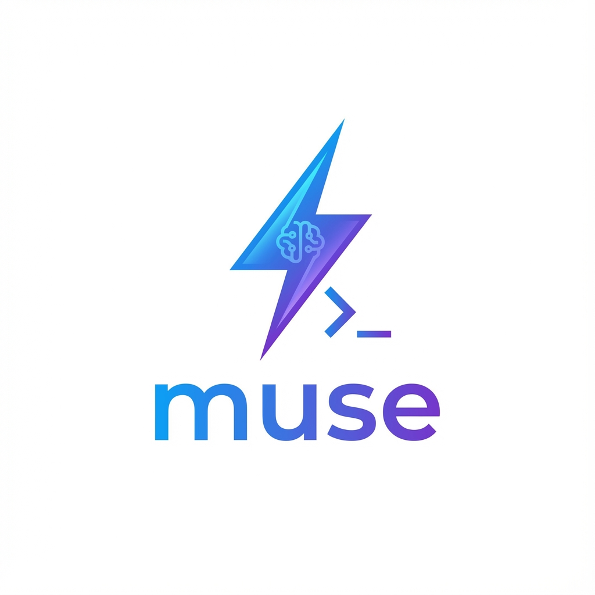
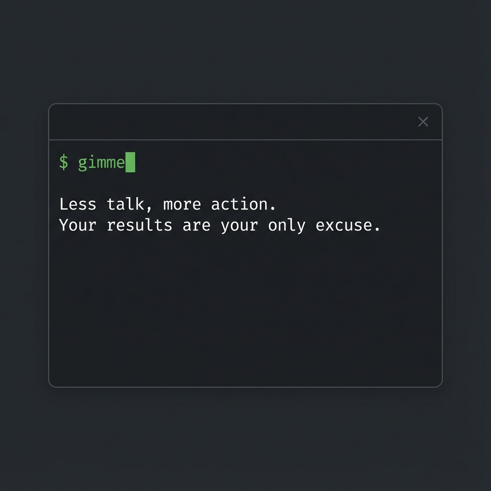
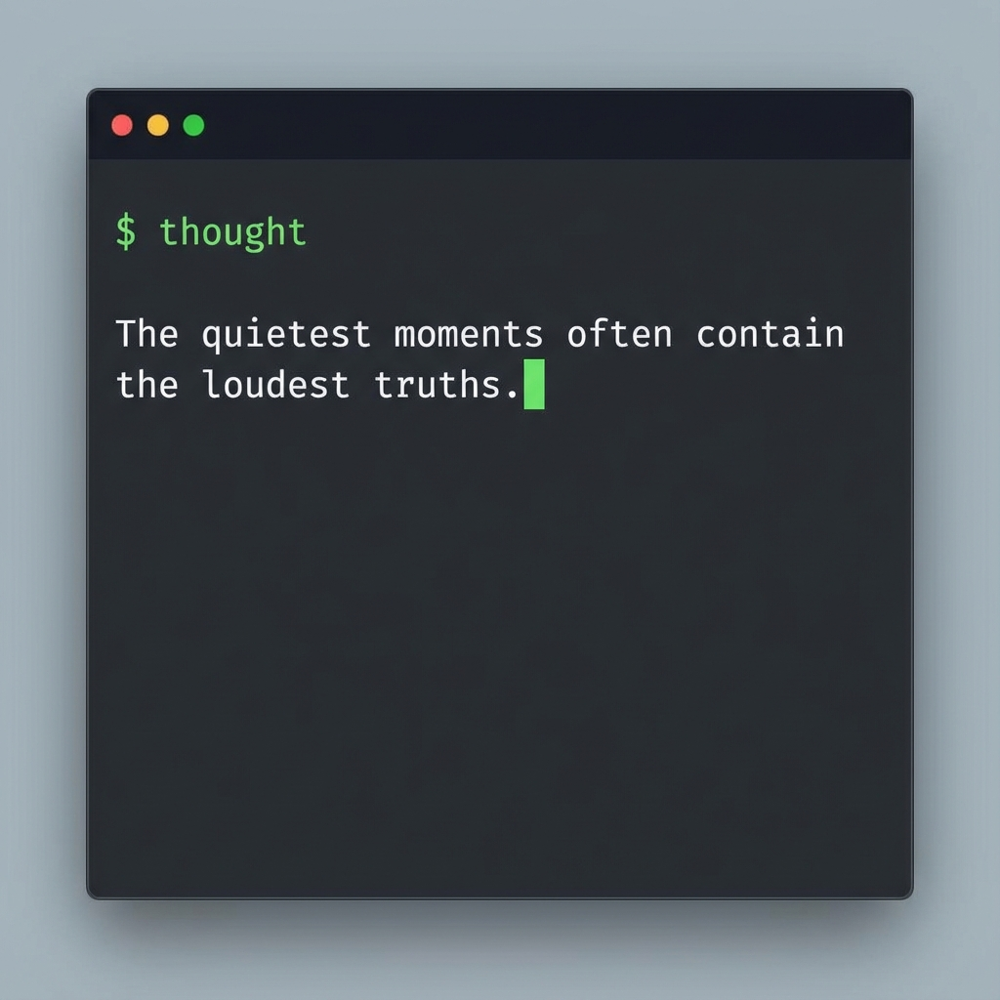
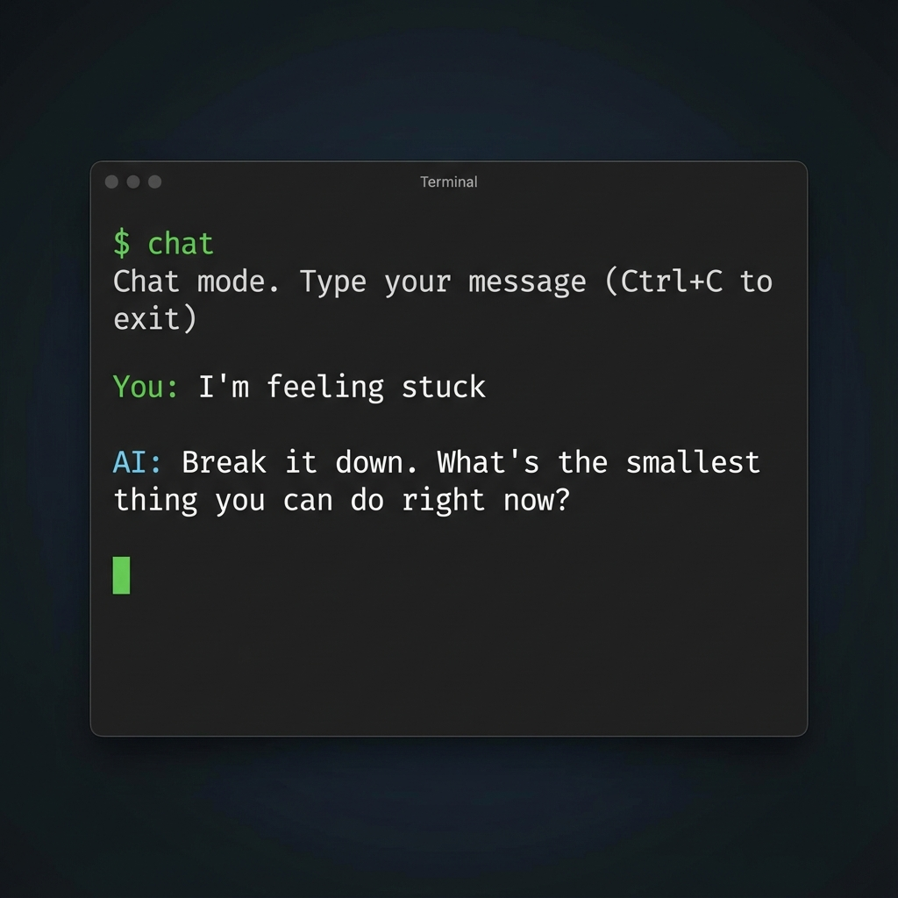

<div align="center">
  
  
  # muse-cli

  ⚡ Your AI companion for instant motivation, reflection, and focus—right in your terminal
</div>

## What is muse-cli?

**muse-cli** is a minimal, AI-powered terminal tool that delivers exactly what you need, when you need it:
- **Quick motivation** when you're stuck
- **Reflective thoughts** for mental clarity  
- **Time-aware inspiration** to match your day
- **Interactive chat** for deeper conversations

Powered by Google Gemini 2.5 Flash and built with Bun for blazing-fast responses.

## Installation

1. **Clone the repository**
   ```bash
   git clone https://github.com/testing-archit/muse-cli.git
   cd muse-cli
   ```

2. **Install dependencies**
   ```bash
   bun install
   ```

3. **Set up your API key**
   
   Get a free API key from [Google AI Studio](https://aistudio.google.com/apikey), then add it to your shell configuration:
   
   ```bash
   echo 'export GEMINI_API_KEY="your_api_key_here"' >> ~/.zshrc
   ```

4. **Add shell functions**
   
   Add these functions to your `~/.zshrc`:
   ```bash
   gimme() {
     bun /path/to/muse-cli/src/index.js gimme
   }

   thought() {
     bun /path/to/muse-cli/src/index.js thought
   }

   motivation() {
     bun /path/to/muse-cli/src/index.js motivation
   }

   chat() {
     bun /path/to/muse-cli/src/index.js chat
   }
   ```

5. **Reload your shell**
   ```bash
   source ~/.zshrc
   ```

## Quick Start Tutorial

Get started with **muse-cli** in seconds. Here's how each command works:

### 1. `gimme` - Instant Motivation

When you need a quick push to get moving:



```bash
$ gimme
Less talk, more action. Your results are your only excuse.
```

Perfect for breaking through procrastination or getting that instant spark.

---

### 2. `thought` - Reflective Clarity

For a moment of reflection without advice:



```bash
$ thought
The quietest moments often contain the loudest truths.
```

Great for meditation breaks or mindful pauses in your day.

---

### 3. `motivation` - Time-Aware Inspiration

Context-aware motivation that adapts to your time of day:


```bash
$ motivation
Good morning! A fresh day awaits your greatness.
Seize every opportunity to create, grow, and inspire.
Make today count!
```

Different messages for morning, afternoon, and night—always relevant.

---

### 4. `chat` - Interactive Companion

Have a conversation when you need to think things through:



```bash
$ chat
Chat mode. Type your message (Ctrl+C to exit)

You: I'm feeling stuck
AI: Break it down. What's the smallest thing you can do right now?
```

Your honest, no-BS terminal companion for deeper discussions.

---

## Usage

### `gimme` - Quick Motivation
Get a sharp, practical push when you need it most.
```bash
$ gimme
Less talk, more action. Your results are your only excuse.
```

### `thought` - Reflective Moments
Receive a single reflective thought. No advice. Just clarity.
```bash
$ thought
The quietest moments often contain the loudest truths.
```

### `motivation` - Time-Aware Inspiration
Get motivational text tailored to your time of day (morning/afternoon/night).
```bash
$ motivation
Good morning! A fresh day awaits your greatness.
Seize every opportunity to create, grow, and inspire.
Make today count!
```

### `chat` - Interactive Companion
Have a conversation with your blunt, honest terminal companion.
```bash
$ chat
Chat mode. Type your message (Ctrl+C to exit)

You: I'm feeling overwhelmed
AI: Break it down. What's the smallest thing you can do right now?
```

## Project Structure

```
muse-cli/
├── src/
│   ├── index.js          # Entry point (command router)
│   ├── commands/
│   │   ├── gimme.js      # Quick motivation
│   │   ├── thought.js    # Reflective thoughts
│   │   ├── motivation.js # Time-aware motivation
│   │   └── chat.js       # Interactive chat
│   ├── ai/
│   │   └── gemini.js     # Gemini API wrapper
│   ├── utils/
│   │   ├── time.js       # Time/day helpers
│   │   ├── location.js   # IP-based location (optional)
│   │   └── prompt.js     # Prompt templates
│   └── config/
│       └── constants.js  # Configuration
├── bin/
│   └── mind              # Executable entry point
└── package.json
```

## Requirements

- [Bun](https://bun.sh/) runtime
- Google Gemini API key (free tier available)

## Philosophy

**muse-cli** follows these principles:
- **Minimal** - No bloat, just what you need
- **Fast** - Bun runtime + Gemini 2.5 Flash
- **Honest** - Blunt, practical, no-nonsense responses
- **Contextual** - Time-aware and conversation-aware

## License

MIT

## Author

Built with focus by [testing-archit](https://github.com/testing-archit)
